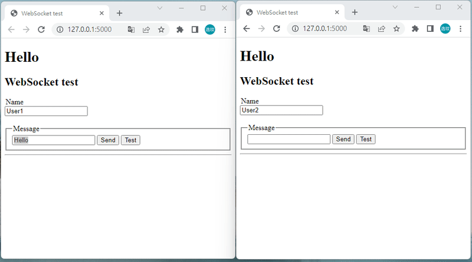

# chat-room

Python Flask Websocket


##  Virtual environment

- Creating virtual environment

  ```
  $ python -m venv venv
  ```

- Activate virtual environment

  ```
  $ .\\venv\\scripts\\activate # On Windows
  ```

* Install packages

  ```
  $ pip install -r requirements.txt
  ```

##  To run the application

```
$ flask run
```

##  Demo



